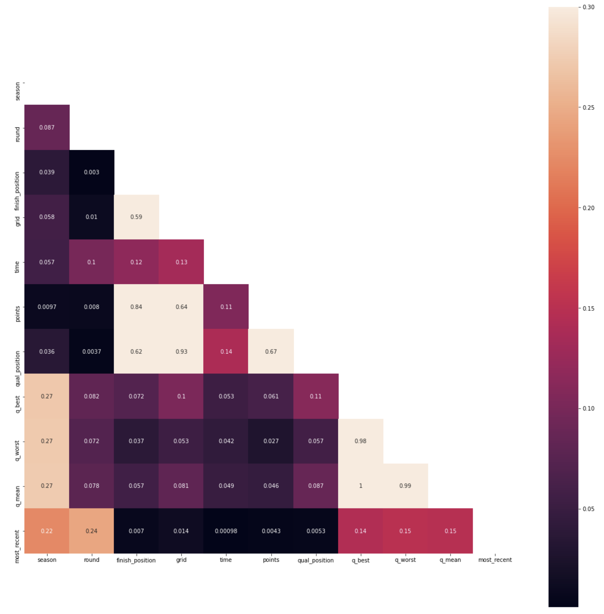
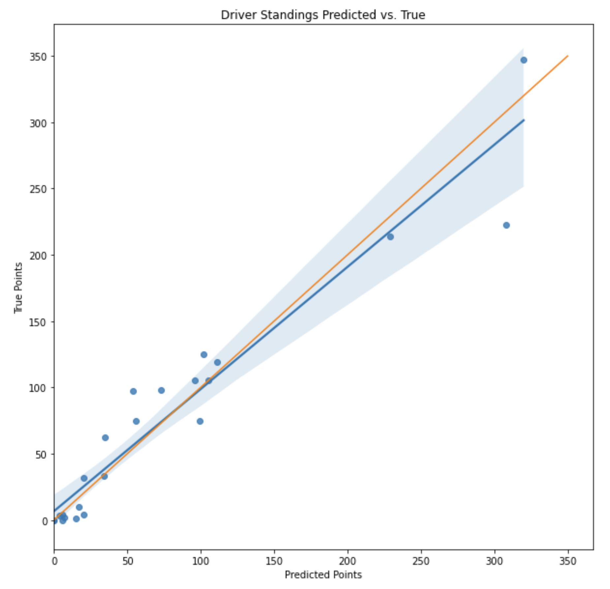
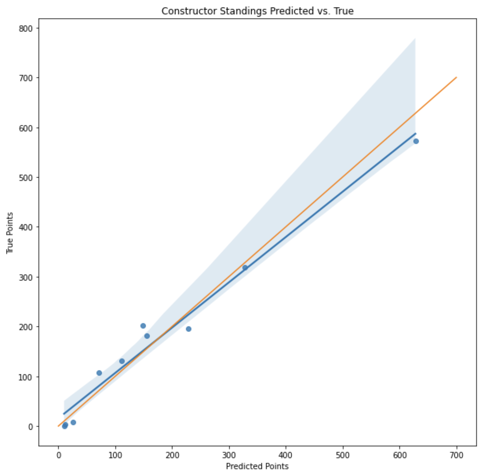

# Formula 1 Race Points Predictor
___
___
### Question: “Can we predict the 2020 Formula 1 Championship, training on pre-2020 data?”
___
___
## Goals of the project (Table of Contents)

The goal of the project was as follows:

1. [Collecting the Data](#1.-Collecting-the-Data)
    1. [Ergast API](#A.-Ergast-API)
    2. [Additional Scraping](#B.-Additional-Scraping)
2. [EDA](#2.-EDA)
    1. [Correlation](#A.-Correlation)
    2. [Age](#B.-Age)
    3. [Mistakes](#C.-Mistakes)
    4. [Circuits](#D.-Circuits)
3. [Modelling](#3.-Modelling)
    1. [Regression/Classification Problem](#A.-Regression/Classification-Problem)
        1. [Justification](#a.-Justification)
        2. [Methodology](#b.-Methodology)
    2. [Success Metrics](#B.-Success-Metrics)
    3. [Feature Engineering](#C.-Feature-Engineering)
    4. [Final Features & Train-Test Split](#D.-Final-Features-&-Train-Test-Split)
    5. [Column Transform & Pipeline](#E.-Column-Transform-&-Pipeline)
        1. [Column Transformers](#a.-Column-Transformers)
        2. [Pipelines](#b.-Pipelines)
    6. [Choosing the Correct Model](#F.-Choosing-the-Correct-Model)
    7. [Results](#G.-Results)
4. [Converting Results back to Classification Form](#4.-Converting-Results-back-to-Classification-Form)
5. [Measuring Success of the Model](#5.-Measuring-Success-of-the-Model)
    1. [Driver Championship](#A.-Driver-Championship)
    2. [Constructor Championship](#B.-Constructor-Championship)
6. [Conclusion & Lessons Learned](#6.-Conclusion-&-Lessons-Learned)
7. [Future Recommendations](#7.-Future-Recommendations) - *what next?*
___
___
## 1. Collecting the Data

The data was collected from Ergast API, which holds data harvested from the Formula 1 website. The API itself holds all information on races, results, drivers, qualifying, lap times, pit stops, constructors’ and drivers’ standings and circuits from Formula 1’s inception in 1950 to date.

The scraping code & detailed steps taken can be found in the following notebook: [LINK](https://github.com/willgeorge93/Formula1/blob/main/Formula%201%20-%20Data%20Collection.ipynb)

The data acquired for each table was as below:
___
### A. Ergast API

 

**`PREDICTOR DATA:`**

| Races | Circuits | Drivers | Results | Qualifying |
| :--- | :--- | :--- | :--- | :--- |
| Season | Circuit ID | Driver ID | Season | Season |
| Round | Circuit Name | Name | Round | Round |
| Race Name | Latitude | Nationality | Circuit ID | Circuit ID |
| Circuit ID | Longitude | Driver Code | Driver ID | Driver ID |
| Latitude | Locality | Date of Birth | Finish Position | Qualifying Position |
| Longitude | Country | | Date of Birth | Constructor |
| Country | Wikipedia URL | | Nationality | Q1 |
| Date | | | Constructor | Q2 |
| Wikipedia URL | | | Grid | Q3 |
| | | | Time |
| | | | Status |
| | | | Points |

  

**`OUTCOME COMPARISON DATA:`**

| 2020 Constructor Standings | 2020 Driver Standings |
| --- | --- |
| Constructor Name | Driver ID |
| Position | Position |
| Points | Points |
___
### B. Additional Scraping

 

**`Races:`**
* Added to Races DataFrame using Wikipedia URLs & BeautifulSoup:
    * *Weather Data*
    * *Overall Race Distance that year*
* Added additional Weather Data to Races via F1-Fansite.com using manipulated Race Name variable, Selenium undetected chromedriver & BeautifulSoup.

 

**`Circuits:`**
* Type of Circuit (Street or Road)
* Clockwise Direction
* Lap Length

___
___
## 2. EDA

The EDA & Visualisation code & detailed steps taken can be found in the following notebook: [LINK](https://github.com/willgeorge93/Formula1/blob/main/Formula%201%20-%20Visualisation.ipynb)

*`Click to expand the headers below containing plots.`*

### A. Correlation

___

    

 How Correlated are the dependent variables? 

As can be seen above, there is little correlation amongst the variables bar those which are closely related in some way, for example the **Q_best**, **Q_mean** & **Q_worst** qualifying times and the **Qualifying**, **Grid** and **Finish positions**. Curiously, of **Qualifying Position** and **Grid Position**, it is **Qualifying Position** that is more closely related to the **Finish Position**. The difference here is that **Grid Position** is essentially the same as **Qualifying Positions** in most cases, bar those where certain drivers have received a grid-place penalty or are unable to start the race for any reason, whereby they will drop down the grid and other drivers will move up.
This hints at some reliability and predictability with drivers and machinery, showing that those drivers who are strong qualifiers will likely be able to claim back a position that better resembles their speed in comparison with other drivers.
Another interesting non-correlation is that of the **Q_best**, **Q_mean** & **Q_worst** and the **Qualifying Position**. Of course, this is likely down to the fact that each track is a different length and can maintain a different average speed throughout the lap. Therefore, across the full dataset of all tracks and all lap times, it is reasonable to say that there is little correlation, although circuit by circuit there would definitely be a high correlation between these variables (although it would be very unlikely these would be 100% correlated.)

___
### B. Age

Age is a defining factor for many decisions made by teams. Younger drivers can be sharp and skillful, but also reckless and emotional. There comes a time where the benefits of youth and experience reach an equilibrium - the drivers’ youthful reactions are met by reliability and maturity. Here, drivers are at their most likely to win races, and are also most likely to appear attractive prospects to teams that are looking for their next big investment in a driver. If one of the top-tier teams was looking for their next driver to help contend for a world championship, one with plenty of years ahead, youthful skills but also the composure to guarantee consistency would be the ideal candidate.
___

 i. What is the Volume of Point Scorers by Age since 2014 

The diagram above shows the peak to be at the age of 25, with a strong right skew and several stages to the decline.

The reasoning for such a strong right skew is two-fold. Firstly, we have decisions made by constructors. Most years you can expect to see at least one or two of the new wave of up-and-coming drivers from Formula 2 come onto the scene in Formula 1. These drivers are always young and replacing someone who has not been performing and/or making a difference for their team. Because of this, the turnover of young drivers is very high and there is a sort of cut-off age past which only the drivers that have proven to have the necessary mettle and an element of luck are able to remain in the sport. It is for this reason that there are so many drivers of a young age competing in the sport, and of those who are able to cement their position in the sport there is then the everlasting pressure of the tradeoff between performance for their team and the viability of investing in the driver for the future of their team. Therefore as time moves on, the older drivers will eventually be dropped from the best teams to lower-tier teams where their experience will still provide some benefit, and then altogether from Formula 1, unless those drivers are particularly rare drivers that are able to continue to score points well into their late 30s and early 40s (e.g. Kimi Räikkönen, Fernando Alonso etc.)

___

 ii. Average number of Point-Scoring Positions achieved by Age 

In the diagram above, we see the opposite side of the coin. The diagram shows the average number of point scoring positions by age of a driver. We know that there is a high volume of young drivers which begins to decline at the age of 27, and with so many unsuccessful drivers being eliminated from teams prior to this age it is understandable that the average number of positions in the points for these ages will be substantially lower. Once we reach the ages of 27+, the average climbs rapidly, since the volume of drivers that make it in Formula 1 through this stage have established themselves in a good team due to strong performance and consistency. From around the 33-year-old mark things are unsurprisingly beginning to fall away as teams would begin to younger drivers as they look towards the future of the teams and drivers are beginning to lose their edge. There are, however, some exceptions - for example the sky-high average point-scoring finishes for 38-year-old drivers was achieved completely in one year by Kimi Räikkönen, who had such a huge effect due to a season of incredible performance and so few other 38-year-old drivers.
    

___
### C. Mistakes
What makes Formula 1 so unpredictable is the inability to predict a drivers’ or constructors’ race-ending event. For example, an illness, a crash, an engine fault, a brake fault or simply a problem in the pit lane that means a car goes into the pits leading the race convincingly, and then never leaves the pits due to a problem with pit machinery forcing the car to retire. This happens very often in Formula 1, with at least one DNF to be expected every race and sometimes up to 7 or more in one race!

It is important to look at driver and constructor consistency to understand why things might have unfolded as they have in the respective championships.
___

 i. Average Number of Mistakes by Drivers with 20+ Races 

Unsurprisingly, at the very top we can see 7-time world champion Lewis Hamilton, well renowned for his risk-conscious driving style, minimising the potential for any endangerment of his position or potential win. This, combined with his overall control of the car, enabled him to ensure he didn’t lose a race in the wet, which is classically characterised as unpredictable personified, for 5 years.

Looking further below Lewis Hamilton, we see multiple other world champions and title contenders, including Nico Rosberg, Valtteri Bottas, Sebastian Vettel, Daniel Ricciardo and Kimi Räikkönen.

At the bottom we can see many of the names now committed to Formula 1 history, including Pastor Maldonado, Esteban Gutierrez, Pascal Wehrlein, Jolyon Palmer and Marcus Ericsson.

Interestingly, there are some names here that are displaced according to this rule. Max Verstappen, the star driver of the Red Bull Racing team and 3rd place finisher after the two dominant Mercedes drivers for the past 2 seasons, shows a comparatively high number of mistakes sitting about ⅔ down in the table. This can be explained by his junior years in F1 from 2015 onwards, where he raced for Renault and then moved to Red Bull in 2016. As discussed previously, it is expected for drivers to make more mistakes during the early days of their career whilst they learn to control temper, manage pressure and become more vigilant in scenarios that could potentially pose damage to their car.

The other, Jenson Button, is highly intriguing since during the time reviewed he will have been in the latter days of his F1 career, following his world championship title in 2009.
Combining deeper investigation with prior knowledge on the progression of Jenson Button’s road to retirement, I would surmise that due to repeated years of uncompetitive machinery and misfortune following 2009 and his decline in motivation to compete in Formula 1 led to more personal mistakes when behind the wheel.

___

 ii. Average Number of Mistakes by Constructors since 2014 

Looking at Constructors’  mistakes, we see the two most successful F1 teams of all time right at the top with the lowest percentage of mistakes vs. races entered. The combined consistency of Mercedes and their drivers Lewis Hamilton, Nico Rosberg and Valtteri Bottas is apparent, and it comes as no surprise that the top 2 spots in the Drivers’ Championships over 5 of the last 7 seasons (2014 - 2020) have been occupied by whichever of these three drivers have been racing Mercedes’ equipment.

Red Bull and Alpha Tauri positioned next to each other, understandably since they are essentially Red Bull’s 1st and 2nd team and therefore use much of the same starting kit inside the cars meaning base reliability should be very similar between these two before separate development begins.

McLaren had many issues in the years following the 2014 season, with 9th place finishes in 2015 and 2017 before incrementally returning to form reminiscent of their former glory, culminating in a third place finish in 2020.

Renault, after taking control of the Lotus F1 team in 2016, had some poor performance in the early days of their hybrid era appearances with a 9th place finish in 2016 while getting their cars and team up-to-speed. Lotus, having performed well between 2012 and 2013, lost both their CEO and their Team Principal (who joined McLaren instead) in 2014, gaining a new Team Principal with no prior Formula 1 experience. Finishing 8th overall in the standings in 2014 and facing problem after problem for both drivers in 2015, Renault had a lot of work to do to recover some of the team’s performance from 2016, and have been improving since.

Right at the bottom we have Caterham, dubbed one of the worst Formula 1 teams of all time, plagued by failure throughout its 2012-2014 lifespan before closing down permanently at the end of 2014 having never scored a point.

___
### D. Circuits
___

 Circuits Used since 2014 & Magnitude 

___
___
## 3. Modelling

The modelling and evaluation code can be found in the following notebook: [LINK](https://github.com/willgeorge93/Formula1/blob/main/Formula%201%20-%20Modelling.ipynb)

### A. Regression/Classification Problem 
#### a. Justification
At this stage, I noticed that if I were to choose a Classification Model, there would be danger of multiple of the same class (position) predicted for a particular race, and perhaps some missing positions. Since classification models can’t be trained to select one of each class, I decided to move forward with a Regression Model.
___
#### b. Methodology
Since one win does not necessarily equate to another, e.g. if a driver wins by a margin of 30 seconds to second place, and another wins by a margin of 1 second to the second place driver, these wins should have some weighting to represent the level of dominance of that driver when performing well.

Therefore, instead of using the ‘Finish Position’ variable, I manufactured a ‘Split Time’ variable by taking the ‘Race Time’ of the first-place finisher for each race and determined the difference of each driver’s Race Time to the first-place finisher. It should be noted that only those who aren’t lapped during the race actually finish the race. As soon as the first-place driver crosses the line, the next time each of the remaining drivers crosses the line it will complete their race, so for a race that is 57 laps long, 56 laps will be completed by those who are lapped once, and 55 for those who are lapped twice.
For this reason, the time of the last driver not to be lapped was carried forward to all other drivers and then the time multiplied by the number of laps lapped by. The majority of the time, at least the first 8-9 drivers will cross the line without being lapped, and since only the top ten finishers score points in a Formula 1 race, the impact of the homogenised target variable should be of minimal consequence.
___
### B. Success Metrics
Despite the use of a regression model, I have decided to use metrics pertaining to a classification model since the results will be converted back into integer positions for evaluation.

This in mind, the success metrics I have chosen are Spearman Rank & Pearson Correlations and R2 Score on predicted and true positions and the MSE and RMSE on the predicted and true points.
___
### C. Feature Engineering
In addition to those features acquired during the Data Collection phase, I created some of my own. After identifying which of the different features I would be able to use to train and/or test the model, I looked to those features I might not be able to make use of for one reason or another. I decided that the following was true:

* Date of Birth of Drivers alone would not be relevant to any form of success.
* Date of the Race would not have any influence on Driver/Constructor performance.
* Since 2nd and 3rd Rounds of Qualifying don’t involve all drivers, the info can’t be used as is.
___
**1. Date of Birth & Race Date**

In order to create a better variable from the Date of Birth and Race Date features, I decided to use datetime to convert the dates into a format with which I could find the length of time between the two dates (in days). For each entry in the data, there was then an entry for the age of each of the drivers at the time of the race.

**2. Qualifying Rounds**

Not all drivers compete in all rounds of qualifying. The qualifying structure is:

* `Q1` : all 20 drivers take part, posting the best time they can for the session. Those in the 16th - 20th places are then set in position.
    
* `Q2` : the top 15 take part, once again posting their fastest lap time. The 11th - 15th fastest are then set in position.
    
* `Q3` : the remaining drivers set out one final time to post the best time they can and all positions are then decided at the end of Q3.

If the qualifying data was used as originally held, around half of the instances in the data would contain null values in certain qualifying sessions. In order to ensure all qualifying data could be used, I created Q_mean, Q_worst and Q_best variables:

* `Q_mean` : the average time across the best times for each qualifying round involved in.

* `Q_best` : the best time across the best times for each qualifying round involved in.
    
* `Q_worst` : the worst time across the best times for each qualifying round involved in.
___
### D. Final Features & Train-Test Split
The data carried forwards to the model is as follows:
* Season
* Round
* Race Name
* Driver Name
* Constructor
* Grid Position
* Qualifying Position
* Q_best
* Q_worst
* Q_mean
* Age During Race
* Locality
* Country
* Type of Circuit (Street or Road)
* Clockwise Direction
* Lap Length
* Weather
* Finish Position
* Points
* Filled Splits

Given that the aim of the model is to predict the Constructors’ and Drivers’ Standings, the Training Set was defined as data from the 2014-2019 seasons and the Test Set as the 2020 season data.

Points and Finish Position variables were included in the train-test split, and then popped out to create **r_train** and **r_test** *(Finish Position)*, & **p_train** & **p_test** *(Points)*. These are to be used as follows:

* `r-train & r_test` : compared with the positional predictions to find the R2 Score using Sci-Kit Learn's Metrics module.

* `p_train & p_test`: compared with the aggregated points predictions at the end to check correlations and other metrics between the true and predicted points.

The defined `Target Variable` for the train-test split was aforementioned **Filled Splits** variable.
___
### E. Column Transform & Pipeline

For transforming the data into a model-ready format, I used Sci-Kit Learn ColumnTransformers and Pipelines.
___
#### a. Column Transformers
The three types of transformation I employed for the final dataset were:

 

| OneHotEncoder | StandardScaler | CountVectorizer |
| :--- | :--- | :--- |
| Season | Q_best | Weather |
| Round | Q_worst | |
| Grid Position | Q_mean | |
| Qualifying Position | Age During Race | |
| Country | Lap Length | |
| Type of Circuit (Street or Road) | | |
| Clockwise Direction | | |
| Locality | | |
| Race Name | | |

 

Whilst the following data was passed through:
* Driver Name
* Constructor
___
#### b. Pipelines
In building the pipelines, I used the make_pipeline() function as part of the Sci-Kit Learn Pipeline library. For tuning, I mounted the Column Transformer for translating the data into the correct format for model usage, followed by a GridSearchCV or RandomizedSearchCV which was loaded with the model of choice.

___
### F. Choosing the Correct Model
After several days of GridSearch Cross-Validation, the model that returned the best scores was the SciKit-Learn RandomForestRegressor.

All models trialled were Cross Validated using GridSearchCV from the Sci-Kit Learn Model Selection module.

The following models were those that were tested using CV:

* Linear Regression
* **Lasso penalised Linear Regression**
* Ridge penalised Linear Regression
* Decision Tree
* K Nearest Neighbours Regressor
* Epsilon-Support Vector Regressor

Lasso, highlighted in bold, was the best performing of these standalone models.

The following Ensemble Methods were then evaluated using the RandomizedSearchCV:

* Neural Network (Multi-Layered Perceptron Regressor)
* **Random Forest Regressor**
* Gradient Boosting Regressor with Linear Regression estimator
* Gradient Boosting Regressor with Lasso estimator
* Bagging Regressor with Linear Regression estimator
* Bagging Regressor with Lasso estimator

Here, the clear winner was the Random Forest Regressor.

*The reasoning for the use of GridSearchCV for standalone models and then RandomizedSearchCV for ensemble methods was the time taken for each model to load. Given that I could very quickly change the parameters with the standalone models, the Grid Search suited well, but I was hoping for less specified parameters to be tested for the models that would take in excess of 12 hours to run and return best params.*

Many tuning steps were taken during project assembly, with many different variations of parameters sampled. Eventually, I came to the conclusion that the best model was to be a somewhat basic RandomForestRegressor, with all default settings except for:

* `ccp_alpha` = 0.04
* `n_estimators` = 1,000
* `criterion` = MSE

The reasoning for this relatively simplistic model is two-fold:

1. *Some of the models would achieve a marginally better R2 score. However, once converted back into classification results and compared using the metrics defined below, the models would actually perform worse when predicting the final outcomes of the project.*

2. *Many of the parameter alterations would often cause for the model runtime to extend greatly, and for negligible to no gain. The reality is that the model needs not be a complex one, perhaps in part due to the process employed to achieve the results having a dampening effect on error.*

The reality is that the model's base parameters perform very strongly.
___
### G. Results
The initial R2 results of the RandomForest Model with 'ccp_alpha' set to 0.04 were:

* `Training Set` : 0.92
* `Test Set` : -0.22

Comparatively, this was the best of all of the models I tried.
___
___
## 4. Converting Results back to Classification Form
In order to convert the model results back to classification, I iterated through the separate results for each race and sorted them into an ordered list of results, taking the index position of each result and applying the ‘index + 1’ to a new column for the ‘Predicted Finish Positions’.
___
___
## 5. Measuring Success of the Model
Since the model’s output is now in the form of distinct positions, I wrote a function for adding a new column to the results dataframe containing the number of points associated with each position as at the 2020 season. These are as follows:

 

| Position | Points |
| :--- | ---: |
| 1st | 25 |
| 2nd | 18 |
| 3rd | 15 |
| 4th | 12 |
| 5th | 10 |
| 6th | 8 |
| 7th | 6 |
| 8th | 4 |
| 9th | 2 |
| 10th | 1 |
| 11th+ | 0 |

 

Upon initial inspection of the R2 Score between positions, the score was very low, with only 18.24% of the true positions matching those that were predicted.

However, since the model's performance was not to be evaluated on predictive power with regard to individual finish positions, I decided to look into varying margins of error to see what percentage of predictions are within a particular range of their target, since upon aggregation these errors may cumulatively cancel to provide greater predictive accuracy that anticipated via the R2 Score.

The following percentages relate to the permissible margins of error listed, up to a permissible predictive error of plus/minus 3 positions.

 

| +/- Positions | Percentage Match |
| :--- | ---: |
| 0 | 18.24% |
| 1 | 41.18% |
| 2 | 52.35% |
| 3 | 61.18% |

 

As can be seen from the table above, with each increase in margin of error for predicted positions, there is a relatively large increase in the number of predictions within the margin from the true value, filling me with some optimism for the model's outcome accuracy.

Using the results table with the now assigned points scored, I used the inbuilt pandas `.groupby()` method to separately groupby constructor and driver for the respective championships and aggregate by summing up the points for each of the groups to produce two separate Predicted Standings tables, as shown below.
___
### A. Driver Championship

 

| Driver | Pred Points | True Points | Pred Pos | True Pos | Pos Error (Diff: Pred - True) |
| :--- | --- | --- | --- | --- | --- |
| Lewis Hamilton | 320 | 347 | 1 | 1 | 0 |
| Valtteri Bottas | 308 | 223 | 2 | 2 | 0 |
| Max Verstappen | 229 | 214 | 3 | 3 | 0 |
| Daniel Ricciardo | 111 | 119 | 4 | 5 | -1 |
| Carlos Sainz | 105 | 105 | 5 | 6 | -1 |
| Sergio Pérez | 102 | 125 | 6 | 4 | 2 |
| Lance Stroll | 99 | 75 | 7 | 10 | -3 |
| Alex Albon | 96 | 105 | 8 | 6 | 2 |
| Charles LeClerc | 73 | 98 | 9 | 8 | 1 |
| Pierre Gasly | 56 | 75 | 10 | 10 | 0 |
| Lando Norris | 54 | 97 | 11 | 9 | 2 |
| Esteban Ocon | 35 | 62 | 12 | 12 | 0 |
| Sebastian Vettel | 34 | 33 | 13 | 13 | 0 |
| Kimi Räikkönen | 20 | 4 | 14 | 16 | -2 |
| Daniil Kvyat | 20 | 32 | 14 | 14 | 0 |
| Nico Hülkenberg | 17 | 10 | 16 | 15 | 1 |
| Kevin Magnussen | 15 | 1 | 17 | 20 | -3 |
| Romain Grosjean | 7 | 2 | 18 | 19 | -1 |
| Antonio Giovinazzi | 6 | 4 | 19 | 16 | 3 |
| Nicholas Latifi | 6 | 0 | 19 | 21 | -2 |
| George Russell | 4 | 3 | 21 | 18 | 3 |
| Pietro Fittipaldi | 0 | 0 | 22 | 21 | 1 |
| Jack Aitken | 0 | 0 | 22 | 21 | 1 |
| **Total** | **-** | **-** | **-** | **-** | **3** |

 

As can be seen above, some of the positions were predicted exactly, such as Lewis Hamilton, Valtteri Bottas, Max Verstappen, Pierre Gasly, Esteban Ocon, Sebastian Vetter and Daniil Kvyat. Those at the very top, Lewis Hamilton, Valtteri Bottas and Max Verstappen are arguably quite easy predictions to make. Although there is a lot of unpredictability in the sport, these are a combination of the most skilled drivers on the grid and the top two constructors on the grid. It was also evident from the model's coefficients that the Mercedes team was the strongest factor in finishing in a top position, and so it was very unlikely that there was going to be any competitor for these top two positions in the Drivers' Standings.

Aside from these, many of the drivers are in roughly the correct positions, with error of 3 as maximum.

The cumulative total of the Positions Error is 3.

 

 

*All metrics are calculated on the `Predicted/True Points`:*

| Metric | Score |
| --- | --- |
| Spearman Rank Correlation | 0.9668 |
| Pearson Correlation | 0.9632 |
| R2 Score | 0.9210 |
| Mean Squared Error | 595.87 |
| Root Mean Squared Error | 24.410 |

 

___
### B. Constructor Championship

 

| Constructor | Pred Points | True Points | Pred Pos | True Pos |
| :--- | --- | --- | --- | --- |
| Mercedes | 628 | 573 | 1 | 1 |
| Red Bull | 325 | 319 | 2 | 2 |
| Racing Point | 218 | 195 | 3 | 4 |
| McLaren | 146 | 202 | 4 | 3 |
| Renault | 159 | 181 | 5 | 5 |
| Ferrari | 107 | 131 | 6 | 6 |
| Alphatauri | 76 | 107 | 7 | 7 |
| Alfa Romeo | 26 | 8 | 8 | 8 |
| Haas | 22 | 3 | 9 | 9 |
| Williams | 10 | 0 | 10 | 10 |

 

For the Constructors' Standings predictions, I expected slightly better results than those in the Drivers' Standings since the error in the standings would receive yet more dampening via further aggregation to achieve only the Constructors' points and positions.

Again, Mercedes convincingly at the top of the table as per the model's coefficients, with perhaps heightened bias due to previous years' results. Following this, Red Bull and some likely suspects lower in the table in Williams' who have been uncharacteristically low performers in the hybrid era, and Haas, who have had a less than exemplary run in Formula 1 since entering the sport in 2014.

To analyse the results for the Constructors' Standings, we can see that all Constructors have been correctly predicted bar those in the 3rd & 4th place positions, giving 80% correct positional prediction.

Interestingly, McLaren only achieved third place in the championship in the last race of the season due to a poor race and retirement of a driver from the Racing Point team, who seemed destined for third place.

McLaren also achieved this off the back of a very poor run in the hybrid era (as discussed previously), where they had more than one 8th place finishes in the recently preceding years.

As we can see from the above table, the only team out of position of those above is the McLaren team, forcing Racing Point to slide down to 4th place.

 

 

*All metrics are calculated on the `Predicted/True Points`:*

| Metric | Score |
| --- | --- |
| Spearman Rank Correlation | 0.9879 |
| Pearson Correlation | 0.9874 |
| R2 Score | 0.9637 |
| Mean Squared Error | 898.60 |
| Root Mean Squared Error | 29.977 |

 

___
___
## 6. Conclusion & Lessons Learned

It is interesting that there was more error in predictions amongst the Drivers' Championship. A common topic in Formula 1 is: 

`"is the Driver's success down to the driver, or the car?"`

With such certainty in the predictions of the **Constructors' Championship**, it appears that the teams that are the best will always win. However, McLaren were able to pull something unexpected out of the bag in claiming a 3rd place finish, so perhaps there is more excitement amongst constructors than a ten-team championship could possibly show on paper.

On the subject the **Drivers' Championship**, There is a lot of unpredictability in terms of positions. Although the Pearson & Spearman Rank Correlations are very high, as is R2 Score, there is a reasonable amount of error in the predicted standings. This shows that, at the top level, the better the car, generally the better the position in the Constructors' Championship. However, in the Drivers' Championship, whilst the top spots might be off-limits to those in mid- and lower-tier technology, there is still a lot to challenge for within a drivers' tier, and driver prowess counts for just as much as the technology they're provided with when trying to extract the best out of the constructors' cars.

___
___
## 7. Future Recommendations

Moving forwards, there are a few things in particular I’d like to focus on to test for improvement in the model:

* Look into availability of more granular hourly weather data to combine with the observed weather data.
    * May not be possible to access timely, location specific data but worth investing time into.
* NLP containing some potentially redundant text.
    * Create more granular data from the scraped weather information - separate air temperature, track temperature, wind speed and general information from the raw scrape.
    * Test use of different stopwords over the more granular data.
* Expand the training data to incorporate previous years examine how this would affect predictions.
* Further expand the range of models tested and tuned, e.g. XGBoost.
    * NOTE: XGBOOST MODEL HAS BEEN TESTED AND A NEW NOTEBOOK CONTAINING THE TUNING PROCESS INCLUDED.
* Test more finite variations in model parameters to incrementally improve scores further.
* Employ cloud computing to offload some of the computation time to optimise model performance.
* Look at creating a web app to predict for different seasons using the current data.
